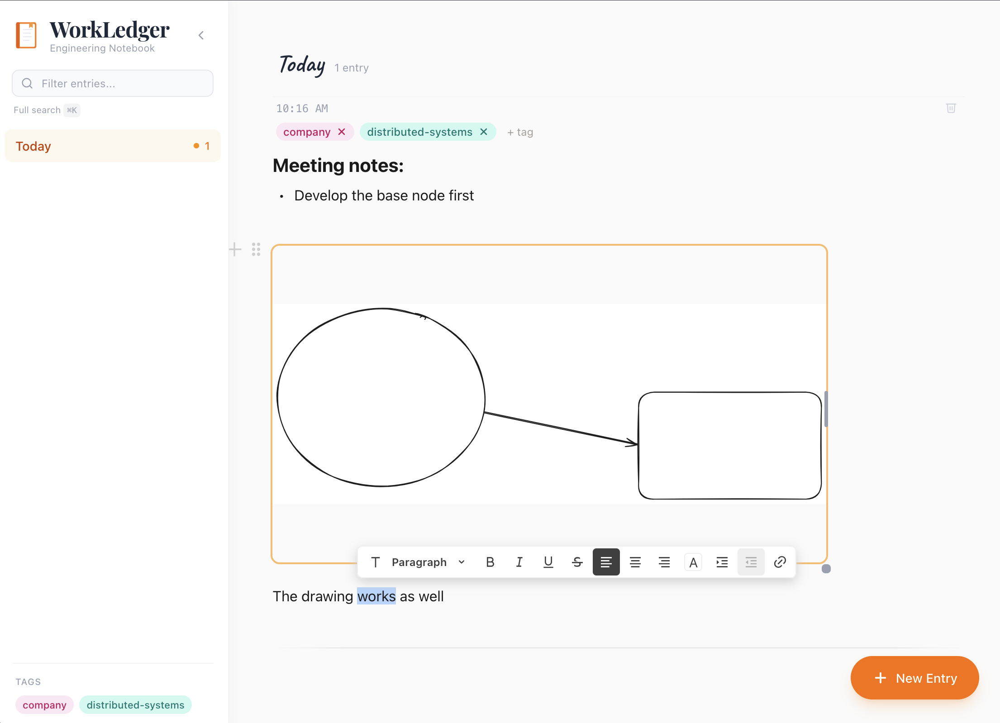

# WorkLedger

An open-source engineering notebook for documenting your daily work. Built with React, BlockNote, and Excalidraw.

<p align="center">
  
</p>

## Features

- **Daily entries** -- Organized by day with timestamps, create entries with `Cmd+J`
- **Rich text editing** -- Powered by [BlockNote](https://blocknotejs.org/) with slash commands for headings, lists, code blocks, and more
- **Inline drawings** -- Embed [Excalidraw](https://excalidraw.com/) diagrams directly in your notes via `/drawing`
- **Tagging** -- Tag entries for easy categorization and filtering
- **Search** -- Full-text search across all entries and tags (`Cmd+K`)
- **Sidebar filtering** -- Click a tag or type to filter entries in real-time
- **Local-first** -- All data stored in IndexedDB, no server required
- **Keyboard-driven** -- `Cmd+J` new entry, `Cmd+K` search, `Cmd+\` toggle sidebar, `Escape` clear filter

## Tech Stack

- [React](https://react.dev/) + [TypeScript](https://www.typescriptlang.org/)
- [BlockNote](https://blocknotejs.org/) -- Rich text block editor
- [Excalidraw](https://excalidraw.com/) -- Whiteboard and drawing tool
- [Tailwind CSS](https://tailwindcss.com/) -- Styling
- [IndexedDB](https://developer.mozilla.org/en-US/docs/Web/API/IndexedDB_API) via [idb](https://github.com/jakearchibald/idb) -- Local storage
- [Vite](https://vitejs.dev/) -- Build tool

## Getting Started

```bash
git clone https://github.com/gruberb/workledger.git
cd workledger
npm install
npm run dev
```

Open [http://localhost:5173](http://localhost:5173) in your browser.

## Usage

1. Press `Cmd+J` or click **+ New Entry** to create a new entry
2. Start typing -- your work is auto-saved to IndexedDB
3. Type `/` for slash commands: headings, lists, code blocks, or drawings
4. Click **+ tag** below the timestamp to add tags to entries
5. Use the sidebar search or click tags to filter entries
6. Press `Cmd+K` for full-text search across all entries

## Project Structure

```
src/
  components/
    editor/       # BlockNote editor, Excalidraw block, slash menu
    entries/       # Entry cards, stream, tag editor
    layout/        # App shell, sidebar, day headers
    search/        # Search panel
  hooks/           # useEntries, useAutoSave, useSearch
  storage/         # IndexedDB layer (entries, search index)
  types/           # TypeScript interfaces
  utils/           # Date formatting, ID generation, tag colors
```

## License

MIT
